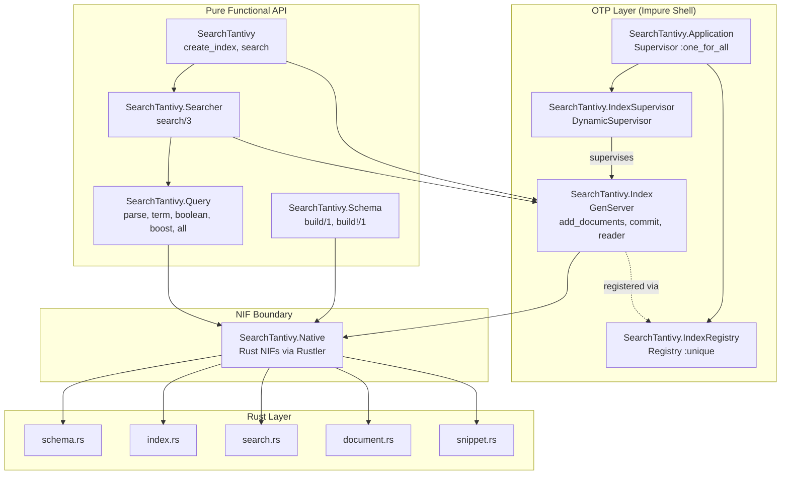
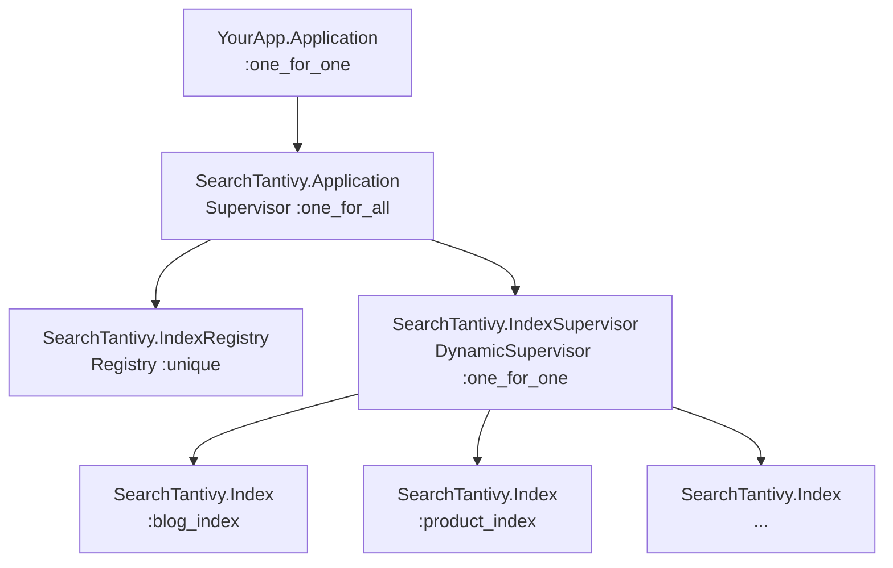
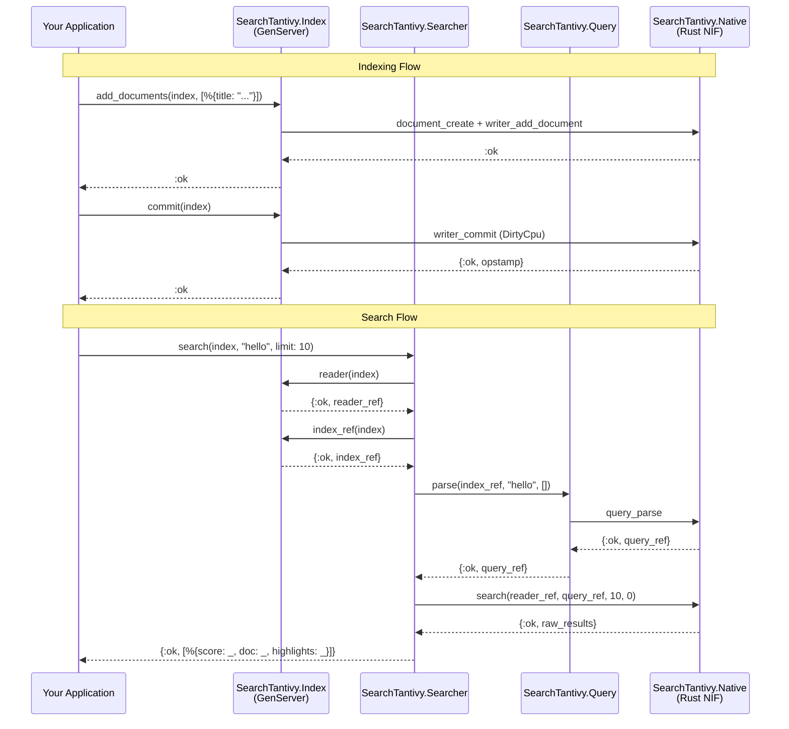
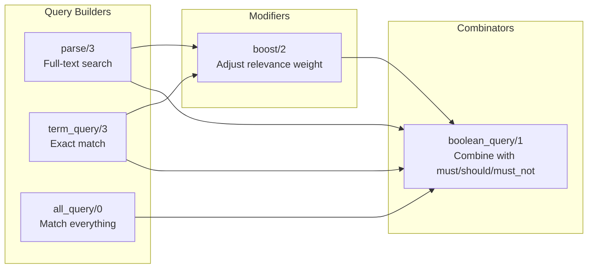
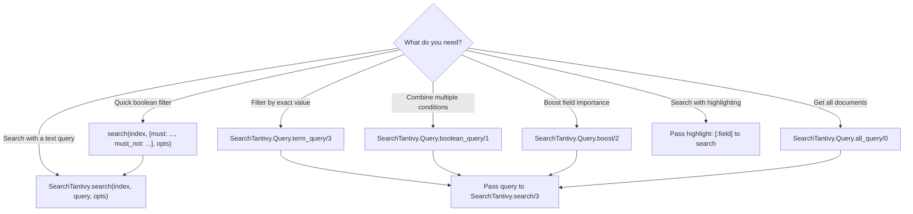

# API User Guide

SearchTantivy is an idiomatic Elixir library wrapping [tantivy](https://github.com/quickwit-oss/tantivy), a high-performance full-text search engine written in Rust. It provides schema-based indexing, composable query construction, snippet highlighting, and supervised index lifecycle management.

## Architecture Overview

SearchTantivy follows a **pure core / impure shell** architecture. Schema building, query construction, and searching are pure functional operations — no processes needed. The only GenServer is `SearchTantivy.Index`, which serializes access to tantivy's single-threaded IndexWriter.



### Module Responsibilities

| Module | Role | Pure? | Description |
|--------|------|-------|-------------|
| `SearchTantivy` | Facade | - | Top-level API, delegates to Index and Searcher |
| `SearchTantivy.Schema` | Builder | Yes | Defines index structure (field types, options) |
| `SearchTantivy.Query` | Builder | Yes | Composable query construction |
| `SearchTantivy.Searcher` | Executor | Yes | Stateless search execution |
| `SearchTantivy.Tokenizer` | Config | - | Register built-in tokenizers |
| `SearchTantivy.Index` | GenServer | No | Index lifecycle (write, commit, read) |
| `SearchTantivy.Application` | Supervisor | No | Optional supervision tree |
| `SearchTantivy.Native` | NIF | No | Rust NIF bindings (internal) |

## Supervision Tree

SearchTantivy is a **library** — it does not auto-start processes. You control when and how supervision starts.



**Why `:one_for_all`?** The Registry must exist before the DynamicSupervisor can register new indexes. If either crashes, both restart together to maintain consistency.

### Setup Options

**Supervised (recommended for applications):**

```elixir
# In your application.ex
def start(_type, _args) do
  children = [
    SearchTantivy.Application,
    # ... your other children
  ]
  Supervisor.start_link(children, strategy: :one_for_one)
end
```

**Unsupervised (scripts, IEx, tests):**

```elixir
{:ok, _} = SearchTantivy.Application.start_link()
```

## Data Flow

This diagram shows how data moves through the system during indexing and searching:



## API Reference

### SearchTantivy (Facade)

The top-level module provides the most common operations.

```elixir
# Create a supervised index (requires SearchTantivy.Application in supervision tree)
{:ok, index} = SearchTantivy.create_index(:name, schema)
{:ok, index} = SearchTantivy.create_index(:name, schema, path: "/tmp/data")

# Open an existing persistent index
{:ok, index} = SearchTantivy.open_index(:name, "/tmp/data")

# Search — accepts strings, query objects, or keyword list boolean shorthand
{:ok, results} = SearchTantivy.search(index, "hello world", limit: 10)
{:ok, results} = SearchTantivy.search(:name, [must: "hello", must_not: "spam"], limit: 10)
```

### SearchTantivy.Schema

Pure functional schema builder. No processes needed.

#### Field Types

| Type | Elixir Atom | Searchable | Description |
|------|-------------|------------|-------------|
| Full-text | `:text` | Tokenized | Split into words, searchable by any term |
| Keyword | `:string` | Exact match | Not tokenized, matches whole value only |
| Unsigned int | `:u64` | Range/exact | 64-bit unsigned integer |
| Signed int | `:i64` | Range/exact | 64-bit signed integer |
| Float | `:f64` | Range/exact | 64-bit floating point |
| Boolean | `:bool` | Exact | `true` or `false` |
| Date | `:date` | Range/exact | ISO 8601 datetime string |
| Bytes | `:bytes` | No | Raw binary data, stored only |
| JSON | `:json` | Nested | JSON objects with nested field access |
| IP Address | `:ip_addr` | Range/exact | IPv4 or IPv6 address |
| Facet | `:facet` | Hierarchical | Path-based hierarchical categories |

#### Field Options

| Option | Type | Default | Description |
|--------|------|---------|-------------|
| `stored` | boolean | `false` | Store original value for retrieval in results |
| `indexed` | boolean | `true` | Include in search index |
| `fast` | boolean | `false` | Enable columnar access (for sorting, aggregation) |
| `tokenizer` | atom | `:default` | Tokenizer to use (`:text` fields only) |

#### Functions

```elixir
# Build a schema (returns {:ok, schema} or {:error, reason})
{:ok, schema} = SearchTantivy.Schema.build([
  {:title, :text, stored: true},
  {:body, :text, stored: true},
  {:category, :string, stored: true, indexed: true},
  {:price, :f64, stored: true, fast: true},
  {:published_at, :date, stored: true}
])

# Bang variant (raises ArgumentError on failure)
schema = SearchTantivy.Schema.build!([{:title, :text, stored: true}])
```

**LLM guidance — field type selection:**
- Use `:text` for human-readable content that should be searchable by individual words
- Use `:string` for identifiers, categories, tags — exact match only
- Use `:u64`/`:i64`/`:f64` for numeric filtering and range queries
- Always set `stored: true` on fields you want returned in search results
- Set `fast: true` on fields used for sorting or aggregation

### SearchTantivy.Index

GenServer managing index lifecycle. Serializes write access to tantivy's IndexWriter.

#### Functions

```elixir
# Create (supervised) — returns {:ok, pid} | {:error, term()}
{:ok, index} = SearchTantivy.Index.create(:name, schema)
{:ok, index} = SearchTantivy.Index.create(:name, schema, path: "/tmp/idx", memory_budget: 100_000_000)

# Open existing — returns {:ok, pid} | {:error, term()}
{:ok, index} = SearchTantivy.Index.open(:name, "/tmp/idx")

# Add documents (buffered, not yet searchable) — returns :ok | {:error, term()}
:ok = SearchTantivy.Index.add_documents(index, [
  %{title: "Hello", body: "World", category: "greeting"}
])

# Commit (makes documents searchable) — returns :ok | {:error, term()}
:ok = SearchTantivy.Index.commit(index)

# Delete documents matching a field value — returns :ok | {:error, term()}
:ok = SearchTantivy.Index.delete_documents(index, :category, "spam")
:ok = SearchTantivy.Index.commit(index)  # Commit to apply deletion

# Get references for advanced query building — returns {:ok, ref} | {:error, term()}
{:ok, index_ref} = SearchTantivy.Index.index_ref(index)
{:ok, reader_ref} = SearchTantivy.Index.reader(index)

# Close gracefully (commits pending changes in terminate/2) — returns :ok
:ok = SearchTantivy.Index.close(index)
```

**LLM guidance — index operations:**
- Documents are maps with atom keys: `%{title: "value"}`
- `add_documents/2` buffers in memory — call `commit/1` to make searchable
- `commit/1` is a relatively expensive operation — batch document additions before committing
- `reader/1` returns a thread-safe reader handle — safe to use from multiple processes
- `close/1` triggers `terminate/2` which commits any pending changes
- Default `memory_budget` is 50MB — increase for large batch imports

### SearchTantivy.Query

Pure functional, composable query builder. All functions return `{:ok, query_ref}` or `{:error, reason}`.

#### Query Composition Diagram



#### Functions

```elixir
# Parse a query string (searches all text fields by default)
{:ok, query} = SearchTantivy.Query.parse(index_ref, "hello world")

# Parse with specific fields
{:ok, query} = SearchTantivy.Query.parse(index_ref, "hello", [:title, :body])

# Exact term match (requires index_ref for field type resolution)
{:ok, query} = SearchTantivy.Query.term_query(index_ref, :category, "tech")

# Match all documents
{:ok, query} = SearchTantivy.Query.all_query()

# Boost a query's relevance weight
{:ok, boosted} = SearchTantivy.Query.boost(query, 2.0)

# Combine queries with boolean logic
{:ok, combined} = SearchTantivy.Query.boolean_query([
  {:must, title_query},       # Required
  {:should, body_query},      # Optional, boosts score
  {:must_not, spam_query}     # Excluded
])
```

**LLM guidance — query construction:**
- `parse/3` supports tantivy query syntax: `"title:hello"`, `"price:[10 TO 100]"`, `"hello AND world"`
- `term_query/3` does exact matching — for `:text` fields, the value must be a single token (lowercase)
- Boolean `:must` = AND, `:should` = OR (boosts score), `:must_not` = NOT
- `boost/2` takes a float factor — `2.0` doubles the relevance weight
- Queries are opaque references — they cannot be inspected, only executed
- All query builders require an `index_ref` (except `all_query/0` and `boost/2`)

#### Tantivy Query Syntax

The `parse/3` function supports tantivy's query parser syntax:

| Syntax | Meaning | Example |
|--------|---------|---------|
| `term` | Search default fields | `hello` |
| `field:term` | Search specific field | `title:hello` |
| `"phrase query"` | Exact phrase match | `"hello world"` |
| `term1 AND term2` | Both required | `elixir AND phoenix` |
| `term1 OR term2` | Either matches | `elixir OR erlang` |
| `NOT term` | Exclude | `NOT spam` |
| `field:[a TO z]` | Range query | `price:[10 TO 100]` |
| `term*` | Prefix query | `hel*` |
| `term~2` | Fuzzy match (edit distance) | `helo~1` |

### SearchTantivy.Searcher

Stateless search execution. Each call gets a fresh reader snapshot.

#### Search Options

| Option | Type | Default | Description |
|--------|------|---------|-------------|
| `limit` | integer | `10` | Maximum results to return |
| `offset` | integer | `0` | Number of results to skip (pagination) |
| `fields` | `[atom()]` | `[]` | Fields to search (empty = all text fields) |
| `highlight` | `[atom()]` | `[]` | Fields to generate highlight snippets for |

#### Result Format

```elixir
{:ok, results} = SearchTantivy.search(index, "hello", limit: 10, highlight: [:title, :body])

# Each result is a map:
%{
  score: 1.5,                                    # float, relevance score
  doc: %{"title" => "Hello", "body" => "..."},   # string keys, stored field values
  highlights: %{title: "<b>Hello</b>"}           # atom keys, highlighted snippets (empty map if not requested)
}
```

**LLM guidance — search patterns:**
- Results use **string keys** in `doc` maps and **atom keys** in `highlights` maps
- Only fields with `stored: true` appear in results
- Highlights contain HTML `<b>` tags around matching terms
- Pagination: `offset: (page - 1) * per_page, limit: per_page`
- Empty results return `{:ok, []}`, not an error

### SearchTantivy.Tokenizer

Register built-in tokenizers on an index.

| Tokenizer | Atom | Description |
|-----------|------|-------------|
| Default | `:default` | Unicode-aware, lowercase, max 40 char tokens |
| Raw | `:raw` | No tokenization — entire value is one token |
| English Stem | `:en_stem` | English stemming (`running` → `run`) |
| Whitespace | `:whitespace` | Split on whitespace only, no lowercasing |

```elixir
{:ok, index_ref} = SearchTantivy.Index.index_ref(index)
:ok = SearchTantivy.Tokenizer.register(index_ref, :en_stem)
```

**LLM guidance — tokenizer selection:**
- `:default` works well for most use cases
- `:en_stem` for English-language content where "running" should match "run"
- `:raw` for exact-match fields (but prefer `:string` field type instead)
- `:whitespace` when you want case-sensitive word splitting

## Unified Search API

`SearchTantivy.search/3` is the single entry point for all searches. It accepts three query forms:

### 1. Query String

```elixir
{:ok, results} = SearchTantivy.search(index, "hello world",
  limit: 10, fields: [:title], highlight: [:title, :body]
)
```

### 2. Pre-Built Query Object

Build queries with `SearchTantivy.Query.*` and pass them directly to `search/3`:

```elixir
{:ok, index_ref} = SearchTantivy.Index.index_ref(index)

{:ok, q1} = SearchTantivy.Query.parse(index_ref, "elixir")
{:ok, q2} = SearchTantivy.Query.term_query(index_ref, :category, "tech")
{:ok, combined} = SearchTantivy.Query.boolean_query([{:must, q1}, {:must, q2}])

{:ok, results} = SearchTantivy.search(index, combined, limit: 10)
```

### 3. Keyword List Boolean Shorthand

For quick boolean queries without building query objects:

```elixir
{:ok, results} = SearchTantivy.search(index, [must: "elixir", must_not: "spam"], limit: 10)

# Mix strings and pre-built query refs in the same keyword list
{:ok, index_ref} = SearchTantivy.Index.index_ref(index)
{:ok, q} = SearchTantivy.Query.parse(index_ref, "phoenix")
{:ok, results} = SearchTantivy.search(index, [must: "elixir", must: q], limit: 10)
```

All three forms return the same result shape: `[%{score: float, doc: map, highlights: map}]`. Highlights use atom keys (`:title`, `:body`). Doc values use string keys (`"title"`, `"body"`).

You can also search by index name (atom) instead of pid:

```elixir
{:ok, results} = SearchTantivy.search(:my_index, "hello", limit: 10)
```

## Common Patterns

### Pagination

```elixir
def search_page(index, query, page, per_page \\ 20) do
  SearchTantivy.search(index, query,
    limit: per_page,
    offset: (page - 1) * per_page
  )
end
```

### Boosted Multi-Field Search

Title matches weighted higher than body matches:

```elixir
{:ok, index_ref} = SearchTantivy.Index.index_ref(index)

{:ok, title_q} = SearchTantivy.Query.parse(index_ref, query, [:title])
{:ok, body_q} = SearchTantivy.Query.parse(index_ref, query, [:body])
{:ok, boosted_title} = SearchTantivy.Query.boost(title_q, 3.0)

{:ok, combined} = SearchTantivy.Query.boolean_query([
  {:should, boosted_title},
  {:should, body_q}
])

{:ok, results} = SearchTantivy.search(index, combined, limit: 10)
```

### Category Filtering with Full-Text Search

```elixir
# Simple approach — keyword list boolean shorthand
{:ok, results} = SearchTantivy.search(index,
  [must: "ergonomic", must: "electronics"],
  limit: 10
)

# With term queries for exact category match
{:ok, index_ref} = SearchTantivy.Index.index_ref(index)

{:ok, text_q} = SearchTantivy.Query.parse(index_ref, user_query)
{:ok, category_q} = SearchTantivy.Query.term_query(index_ref, :category, "tech")

{:ok, filtered} = SearchTantivy.Query.boolean_query([
  {:must, text_q},
  {:must, category_q}
])

{:ok, results} = SearchTantivy.search(index, filtered, limit: 10)
```

### Add and Commit in One Step

```elixir
# Convenience function — adds documents and commits atomically
:ok = SearchTantivy.Index.add_and_commit(index, [
  %{title: "New Post", body: "Content here", category: "tech"}
])
```

### Delete and Re-Index

```elixir
# Delete all documents with category "outdated"
:ok = SearchTantivy.Index.delete_documents(index, :category, "outdated")

# Add replacement documents
:ok = SearchTantivy.Index.add_documents(index, new_documents)

# Single commit applies both deletion and addition
:ok = SearchTantivy.Index.commit(index)
```

### Persistent Index — Create and Reopen

```elixir
# First run: create the index
schema = SearchTantivy.Schema.build!([{:title, :text, stored: true}])
{:ok, index} = SearchTantivy.create_index(:docs, schema, path: "/var/data/docs_index")
:ok = SearchTantivy.Index.add_documents(index, documents)
:ok = SearchTantivy.Index.commit(index)

# Later (or after restart): reopen the existing index
{:ok, index} = SearchTantivy.open_index(:docs, "/var/data/docs_index")
{:ok, results} = SearchTantivy.search(index, "hello", limit: 10)
```

## Error Handling

### Return Conventions

Operations follow two return conventions:

- **Operations that return a value:** `{:ok, value} | {:error, reason}` — `create_index`, `open_index`, `search`, `Schema.build`, `Query.*`, `Index.reader`, `Index.index_ref`, `Index.schema_ref`
- **Side-effect operations:** `:ok | {:error, reason}` — `Index.add_documents`, `Index.delete_documents`, `Index.commit`, `Tokenizer.register`
- **Infallible operations:** `:ok` — `Index.close`

Error reasons are strings from the Rust layer.

```elixir
# Pattern match on {:ok, value} for operations returning data
case SearchTantivy.search(index, "hello", limit: 10) do
  {:ok, results} -> process_results(results)
  {:error, reason} -> Logger.error("Search failed: #{reason}")
end

# Pattern match on bare :ok for side-effect operations
case SearchTantivy.Index.commit(index) do
  :ok -> Logger.info("Committed successfully")
  {:error, reason} -> Logger.error("Commit failed: #{reason}")
end

# Bang variants raise on error (Schema only)
schema = SearchTantivy.Schema.build!([{:title, :text}])  # Raises ArgumentError on failure
```

**Common error scenarios:**
- Invalid field type in schema → `{:error, "invalid field type: ..."}`
- Query parse failure → `{:error, "query parse error: ..."}`
- Unknown field in query → `{:error, "field not found: ..."}`
- Index open failure (bad path) → `{:error, "..."}`

### Crash Resilience

SearchTantivy is designed to **never crash the BEAM VM**. Two layers of protection ensure fault tolerance:

#### Layer 1: NIF Panic Catching

Every Rust NIF entry point is wrapped with `std::panic::catch_unwind` via the `catch_nif_panic!` macro. If the Rust search engine panics (assertion failure, out-of-bounds access, corrupted data), the panic is caught and converted to a normal error tuple:

```elixir
# A Rust panic becomes a regular {:error, _} — no BEAM crash
{:error, "NIF panic: index out of bounds"} = SearchTantivy.search(index, malformed_query)
```

This is completely transparent — NIF panic errors follow the same `{:ok, _} | {:error, _}` convention as all other errors. No special handling is needed.

#### Layer 2: OTP Supervision

The `SearchTantivy.Index` GenServer processes are managed by a DynamicSupervisor. If a GenServer crashes (unexpected message, linked process death, unhandled exception), the supervisor automatically restarts it.

The top-level `:one_for_all` strategy ensures the Registry and DynamicSupervisor always restart together — if the Registry crashes, all indexes are restarted to re-register themselves.

```
SearchTantivy.Supervisor (:one_for_all)
├── IndexRegistry    — crash here restarts everything below
└── IndexSupervisor  — crash of one index restarts only that index
    ├── Index :blog
    └── Index :products
```

#### Failure Modes and Recovery

| Failure | Protection Layer | What Your Code Sees |
|---------|-----------------|-------------------|
| Rust panic (assertion, OOB) | NIF catch_unwind | `{:error, "NIF panic: ..."}` |
| Invalid query syntax | tantivy error handling | `{:error, "query parse error: ..."}` |
| Corrupted index on disk | tantivy error handling | `{:error, "..."}` on open/search |
| GenServer crash | OTP Supervisor restart | Next call works; brief `{:error, :noproc}` possible |
| Registry crash | `:one_for_all` restart | All indexes restart and re-register |

No special error handling code is required beyond normal `{:ok, _}` / `{:error, _}` pattern matching.

## Performance Notes

- **Writer budget:** Default is 50MB. Increase for large batch imports (`memory_budget: 100_000_000`)
- **Commit frequency:** Each commit creates a new segment. Batch documents before committing
- **Reader snapshots:** Readers see a consistent snapshot at creation time. Create a new reader after commit to see new documents
- **NIF scheduling:** Search and commit use dirty CPU schedulers (operations >1ms). Schema and query building use normal schedulers (<1ms)
- **Concurrency:** Multiple processes can search simultaneously (readers are thread-safe). Only one writer exists per index (serialized by the GenServer)

## Integration Examples

### Phoenix Context

```elixir
defmodule MyApp.Search do
  @moduledoc "Search context — public API for search operations."

  def search_articles(query, opts \\ []) do
    page = Keyword.get(opts, :page, 1)
    per_page = Keyword.get(opts, :per_page, 20)

    SearchTantivy.search(:articles_index, query,
      limit: per_page,
      offset: (page - 1) * per_page,
      highlight: [:title, :body]
    )
  end

  def index_article(%{title: title, body: body, id: id}) do
    :ok = SearchTantivy.Index.add_documents(:articles_index, [
      %{title: title, body: body, article_id: to_string(id)}
    ])
    SearchTantivy.Index.commit(:articles_index)
  end
end
```

### GenServer with Search State

```elixir
defmodule MyApp.SearchCache do
  use GenServer

  def start_link(opts), do: GenServer.start_link(__MODULE__, opts, name: __MODULE__)

  def search(query), do: GenServer.call(__MODULE__, {:search, query})

  @impl true
  def init(opts) do
    schema = SearchTantivy.Schema.build!([
      {:content, :text, stored: true},
      {:source, :string, stored: true}
    ])
    {:ok, index} = SearchTantivy.create_index(opts[:name], schema)
    {:ok, %{index: index}}
  end

  @impl true
  def handle_call({:search, query}, _from, %{index: index} = state) do
    result = SearchTantivy.search(index, query, limit: 10)
    {:reply, result, state}
  end
end
```

## Quick Decision Guide



## Guide Index

| Guide | Content |
|-------|---------|
| [Getting Started](getting_started.md) | Installation, quick start, supervision setup |
| [Examples](examples.md) | Three complete runnable examples (blog, e-commerce, knowledge base) |
| API Guide (this file) | Architecture, full API reference, integration patterns |
