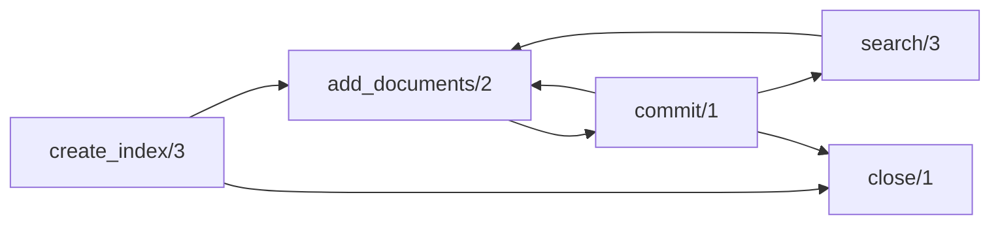

# Getting Started

## Installation

Add `search_tantivy` to your dependencies in `mix.exs`:

```elixir
def deps do
  [
    {:search_tantivy, "~> 0.1.0"}
  ]
end
```

You need Rust installed (via [rustup](https://rustup.rs/)) for compilation.

## Quick Start

### 1. Define a Schema

```elixir
schema = SearchTantivy.Schema.build!([
  {:title, :text, stored: true},
  {:body, :text, stored: true},
  {:url, :string, stored: true, indexed: true}
])
```

### 2. Create an Index

```elixir
# Start the supervision tree first
{:ok, _} = SearchTantivy.Application.start_link()

# Create an in-memory index
{:ok, index} = SearchTantivy.create_index(:my_blog, schema)

# Or a persistent index
{:ok, index} = SearchTantivy.create_index(:my_blog, schema, path: "/tmp/blog_index")
```

### 3. Add Documents

```elixir
:ok = SearchTantivy.Index.add_documents(index, [
  %{title: "Hello World", body: "First post content", url: "/hello"},
  %{title: "Elixir Search", body: "tantivy is fast", url: "/search"}
])

:ok = SearchTantivy.Index.commit(index)
```

### 4. Search

```elixir
{:ok, results} = SearchTantivy.search(index, "hello", limit: 10)

for %{score: score, doc: doc} <- results do
  IO.puts("#{score}: #{doc["title"]}")
end
```

## Supervision

SearchTantivy is a library — it does not auto-start processes. Add `SearchTantivy.Application` to your application's supervision tree:

```elixir
# In your application.ex
def start(_type, _args) do
  children = [
    SearchTantivy.Application,
    # ... your other children
  ]

  Supervisor.start_link(children, strategy: :one_for_one)
end
```

## Common Use Cases

### Blog Search with Highlighting

```elixir
schema = SearchTantivy.Schema.build!([
  {:title, :text, stored: true},
  {:body, :text, stored: true},
  {:tags, :string, stored: true}
])

{:ok, index} = SearchTantivy.create_index(:blog, schema)

:ok = SearchTantivy.Index.add_documents(index, [
  %{title: "Elixir GenServer Guide", body: "GenServer is an OTP behaviour...", tags: "elixir"},
  %{title: "Phoenix LiveView", body: "LiveView enables real-time...", tags: "phoenix"}
])
:ok = SearchTantivy.Index.commit(index)

{:ok, results} = SearchTantivy.search(index, "elixir",
  limit: 20,
  highlight: [:title, :body]
)

for %{doc: doc, highlights: highlights} <- results do
  title = Map.get(highlights, :title, doc["title"])
  IO.puts(title)
  # "Elixir <b>GenServer</b> Guide" or highlighted version
end
```

### Boolean Queries — Filtering Results

```elixir
# Keyword list shorthand — no query building needed
{:ok, results} = SearchTantivy.search(index, [must: "elixir", must_not: "phoenix"], limit: 10)

# Or with pre-built query objects (also works with search/3)
{:ok, index_ref} = SearchTantivy.Index.index_ref(index)
{:ok, q_elixir} = SearchTantivy.Query.parse(index_ref, "elixir")
{:ok, q_phoenix} = SearchTantivy.Query.parse(index_ref, "phoenix")

{:ok, filtered} = SearchTantivy.Query.boolean_query([
  {:must, q_elixir},
  {:must_not, q_phoenix}
])

{:ok, results} = SearchTantivy.search(index, filtered, limit: 10)
```

### Boosted Multi-Field Search

```elixir
{:ok, index_ref} = SearchTantivy.Index.index_ref(index)

# Title matches are 3x more important than body matches
{:ok, title_q} = SearchTantivy.Query.parse(index_ref, "elixir", [:title])
{:ok, body_q} = SearchTantivy.Query.parse(index_ref, "elixir", [:body])
{:ok, boosted_title} = SearchTantivy.Query.boost(title_q, 3.0)

{:ok, combined} = SearchTantivy.Query.boolean_query([
  {:should, boosted_title},
  {:should, body_q}
])

{:ok, results} = SearchTantivy.search(index, combined, limit: 10)
```

### Add and Commit in One Step

```elixir
# Convenience function — adds documents and commits atomically
:ok = SearchTantivy.Index.add_and_commit(index, [
  %{title: "New Post", body: "Content here", tags: "elixir"}
])
```

### Pagination

```elixir
page = 3
per_page = 20

{:ok, results} = SearchTantivy.search(index, "search term",
  limit: per_page,
  offset: (page - 1) * per_page
)
```

## Search Options

| Option | Type | Default | Description |
|--------|------|---------|-------------|
| `:limit` | integer | 10 | Maximum results to return |
| `:offset` | integer | 0 | Number of results to skip |
| `:fields` | list of atoms | `[]` (all text fields) | Fields to search |
| `:highlight` | list of atoms | `[]` | Fields to generate snippets for |

## Crash Resilience

SearchTantivy is designed to **never crash the BEAM VM**, even if the underlying Rust search engine encounters an error. This is achieved through two layers of protection:

### Layer 1: NIF Panic Catching

Every Rust NIF is wrapped with `catch_unwind`, which converts Rust panics into `{:error, "NIF panic: ..."}` tuples instead of crashing the BEAM. This means a malformed query, corrupted index, or unexpected Rust error returns a normal Elixir error:

```elixir
# Even if the Rust layer panics internally, you get a safe error tuple
case SearchTantivy.search(index, query) do
  {:ok, results} -> process(results)
  {:error, "NIF panic: " <> reason} -> Logger.error("Search engine error: #{reason}")
  {:error, reason} -> Logger.error("Search failed: #{reason}")
end
```

### Layer 2: OTP Supervision

The `SearchTantivy.Index` GenServer is supervised by the DynamicSupervisor. If an Index process crashes for any reason (unexpected message, timeout, linked process death), it is automatically restarted by the supervisor. The `:one_for_all` strategy at the top level ensures the Registry and DynamicSupervisor always restart together.

```elixir
# Your application supervision tree — SearchTantivy restarts automatically
children = [
  SearchTantivy.Application,  # Supervises all indexes
  # ... your other children
]
Supervisor.start_link(children, strategy: :one_for_one)
```

### What This Means in Practice

- A **Rust panic** (e.g., assertion failure, out-of-bounds) → returns `{:error, "NIF panic: ..."}`, your application continues running
- A **GenServer crash** (e.g., unexpected message) → supervisor restarts the index process, search becomes available again
- A **corrupted index** → open/search returns `{:error, reason}`, handle gracefully in your application code

No special error handling code is needed beyond normal `{:ok, _}` / `{:error, _}` pattern matching.

## Index Lifecycle



- **create_index** — Creates a new index (RAM or disk) and starts a supervised GenServer.
- **add_documents** — Adds documents to the writer buffer. Not searchable until committed.
- **commit** — Flushes the writer to make documents searchable. Can be called multiple times.
- **search** — Stateless search against the committed index. Does not require the GenServer.
- **close** — Gracefully stops the GenServer. Pending changes are committed in `terminate/2`.
